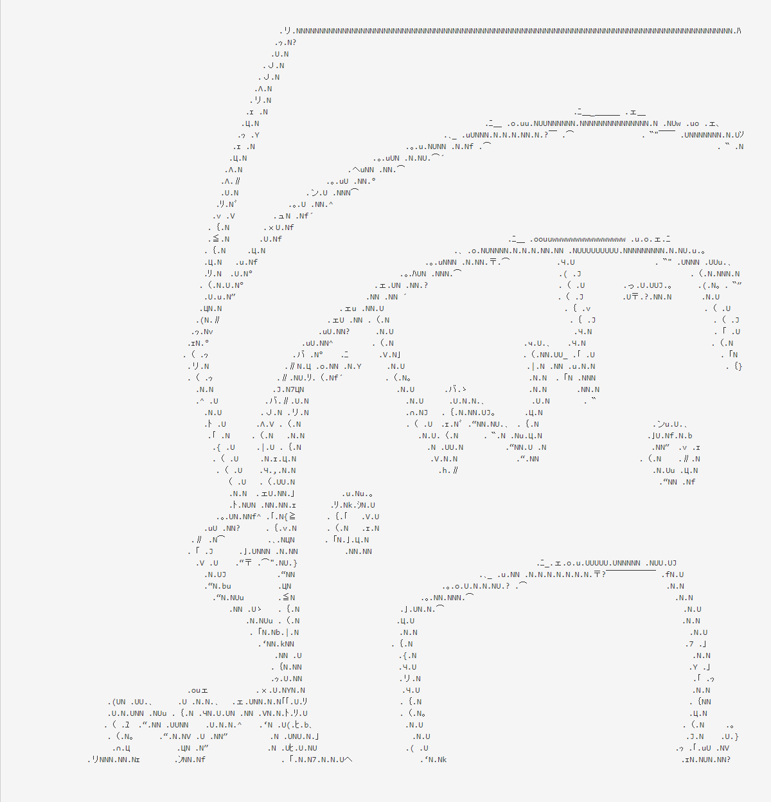

# AsciiArt-Converter

画像をAA化するwebサービスです． 
精度がよく，等幅フォントでアスキーアートを作成してくれるツールが見当たらなかったので作成しました． 
AA変換はlibフォルダ内の自作ライブラリを使用しています．

[PageSpeed](http://ur0.work/tjhH)

## フレームワーク
Play Framework 2.5.1 + Java 8

## 構成
+ リバースプロキシサーバ  Nginx
+ アプリケーションサーバ  Netty Server x 2 
+ サーバOS　Ubuntu 16.04(!)

## 変換アルゴリズム概要
1. ラプラシアンフィルタで輪郭画像を生成．輪郭画像は二値画像．
2. 輪郭画像のノイズ除去
3. 画像を行の高さで分割する．分割された画像ごとに，並列で以下の処理を行う 
  → 行の左から順に当てはめる文字を選択する．輪郭線の方向と文字の輪郭線の方向がマッチしていればその文字を採用する．マッチしていなければ画像と，文字を画像化したものでどの程度画素が一致しているかを比較し，十分一致しているものを選択する．

## 変換例

